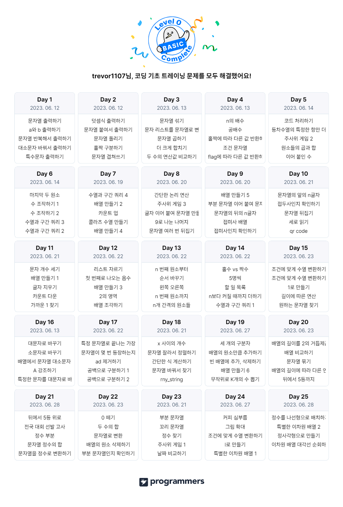

# [프로그래머스 코딩 기초 트레이닝](https://school.programmers.co.kr/learn/challenges/training?order=acceptance_desc&page=1)

레벨 0 단계로 구성되어 있는 "프로그래머스 코딩 기초 트레이닝" 과정에 대한 문제 풀이를 기록합니다.

1. [Day 1 출력](day1.js)
   1. 문자열 출력하기
   2. a와 b 출력하기
   3. 문자열 반복해서 출력하기
   4. 대소문자 바꿔서 출력하기
   5. 특수문자 출력하기
2. [Day 2 출력, 연산](day2.js)
   1. 덧셈식 출력하기
   2. 문자열 붙여서 출력하기
   3. 문자열 돌리기
   4. 홀짝 구분하기
   5. 문자열 겹쳐쓰기
3. [Day 3 연산](day3.js)
   1. 문자열 섞기
   2. 문자 리스트를 문자열로 변환하기
   3. 문자열 곱하기
   4. 더 크게 합치기
   5. 두 수의 연산값 비교하기
4. [Day 4 연산, 조건문](day4.js)
   1. n의 배수
   2. 공배수
   3. 홀짝에 따라 다른 값 반환하기
   4. 조건 문자열
   5. flag에 따라 다른 값 반환하기
5. [Day 5 조건문](day5.js)
   1. 코드 처리하기
   2. 등차수열의 특정한 항만 더하기
   3. 주사위 게임 2
   4. 원소들의 곱과 합
   5. 이어 붙인 수
6. [Day 6 조건문, 만복문](day6.js)
   1. 마지막 두 원소
   2. 수 조작하기 1
   3. 수 조작하기 2
   4. 수열과 구간 쿼리 3
   5. 수열과 구간 쿼리 2
7. [Day 7 반복문](day7.js)
   1. 수열과 구간 쿼리 4
   2. 배열 만들기 2
   3. 카운트 업
   4. 콜라츠 수열 만들기
   5. 배열 만들기 4
8. [Day 8 조건문, 문자열](day8.js)
   1. 간단한 논리 연산
   2. 주사위 게임 3
   3. 글자 이어 붙여 문자열 만들기
   4. 9로 나눈 나머지
   5. 문자열 여러 번 뒤집기
9. [Day 9 문자열](day9.js)
   1. 배열 만들기 5
   2. 부분 문자열 이어 붙여 문자열 만들기
   3. 문자열의 뒤의 n글자
   4. 접미사 배열
   5. 접미사인지 확인하기
10. [Day 10 문자열](day10.js)
    1. 문자열의 앞의 n글자
    2. 접두사인지 확인하기
    3. 문자열 뒤집기
    4. 세로 읽기
    5. qr code
11. [Day 11 리스트(배열)](day11.js)
    1. 문자 개수 세기
    2. 배열 만들기 1
    3. 글자 지우기
    4. 카운트 다운
    5. 가까운 1 찾기
12. [Day 12 리스트(배열)](day12.js)
    1. 리스트 자르기
    2. 첫 번째로 나오는 음수
    3. 배열 만들기 3
    4. 2의 영역
    5. 배열 조각하기
13. [Day 13 리스트(배열)](day13.js)
    1. n 번째 원소부터
    2. 순서 바꾸기
    3. 왼쪽 오른쪽
    4. n 번째 원소까지
    5. n개 간격의 원소들
14. [Day 14 리스트(배열)](day14.js)
    1. 홀수 vs 짝수
    2. 5명씩
    3. 할 일 목록
    4. n보다 커질 때까지 더하기
    5. 수열과 구간 쿼리 1
15. [Day 15 리스트(배열), 문자열](day15.js)
    1. 조건에 맞게 수열 변환하기 1
    2. 조건에 맞게 수열 변환하기 2
    3. 1로 만들기
    4. 길이에 따른 연산
    5. 원하는 문자열 찾기
16. [Day 16 문자열](day16.js)
    1. 대문자로 바꾸기
    2. 소문자로 바꾸기
    3. 배열에서 문자열 대소문자 변환하기
    4. A 강조하기
    5. 특정한 문자를 대문자로 바꾸기
17. [Day 17 문자열](day17.js)
    1. 특정 문자열로 끝나는 가장 긴 부분 문자열 찾기
    2. 문자열이 몇 번 등장하는지 세기
    3. ad 제거하기
    4. 공백으로 구분하기 1
    5. 공백으로 구분하기 2
18. [Day 18 문자열](day18.js)
    1. x 사이의 개수
    2. 문자열 잘라서 정렬하기
    3. 간단한 식 계산하기
    4. 문자열 바꿔서 찾기
    5. rny_string
19. [Day 19 문자열, 리스트(배열)](day19.js)
    1. 세 개의 구분자
    2. 배열의 원소만큼 추가하기
    3. 빈 배열에 추가, 삭제하기
    4. 배열 만들기 6
    5. 무작위로 K개의 수 뽑기
20. [Day 20 함수(메서드)](day20.js)
    1. 배열의 길이를 2의 거듭제곱으로 만들기
    2. 배열 비교하기
    3. 문자열 묶기
    4. 배열의 길이에 따라 다른 연산하기
    5. 뒤에서 5등까지
21. [Day 21 함수(메서드)](day21.js)
    1. 뒤에서 5등 위로
    2. 전국 대회 선발 고사
    3. 정수 부분
    4. 문자열 정수의 합
    5. 문자열을 정수로 변환하기
22. [Day 22 함수(메서드), 조건문 활용](day22.js)
    1. 0 떼기
    2. 두 수의 합
    3. 문자열로 변환
    4. 배열의 원소 삭제하기
    5. 부분 문자열인지 확인하기
23. [Day 23 조건문 활용](day23.js)
    1. 부분 문자열
    2. 꼬리 문자열
    3. 정수 찾기
    4. 주사위 게임 1
    5. 날짜 비교하기
24. [Day 24 조건문 활용, 반복문 활용, 이차원 리스트(배열)](day24.js)
    1. 커피 심부름
    2. 그림 확대
    3. 조건에 맞게 수열 변환하기 3
    4. l로 만들기
    5. 특별한 이차원 배열 1
25. [Day 25 이차원 리스트(배열)](day25.js)
    1. 정수를 나선형으로 배치하기
    2. 특별한 이차원 배열 2
    3. 정사각형으로 만들기
    4. 이차원 배열 대각선 순회하기

